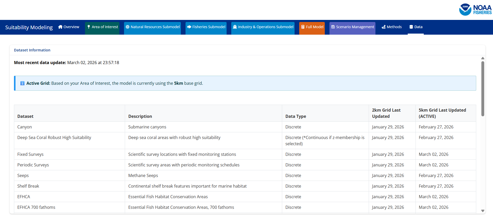

For the most up to date information regarding when data was last processed please see the `Data` tab on the SMORES app. This tab includes the following information: Dataset name, brief description, the data type (discrete/continuous), the date data was last processed for the 2km and 5km grids, and which grid is currently active. 

For information regarding the original data source please see the descriptions below. 

# Area of Interest Layers 

## Wind Energy Areas 

**Brief Description**: Wind Energy Areas were derived from wind energy area boundaries off the coasts of California and Oregon obtained from the Bureau of Ocean Energy Management (BOEM). These data sources were filtered and merged to include the following wind energy areas: Morro Bay, Humboldt, Coos Bay, and Brookings. 

**Data Access**:

- California Wind Energy Area Boundaries: [ArcGIS Rest Service](https://services7.arcgis.com/G5Ma95RzqJRPKsWL/ArcGIS/rest/services/Wind_Lease_Boundaries__BOEM_/FeatureServer){target="_blank"}

- Draft Oregon Wind Energy Area Boundaries: [Link](https://www.boem.gov/renewable-energy/state-activities/oregon-activities){target="_blank"}

**Citation**: Bureau of Ocean Energy Management (BOEM), Office of Renewable Energy Programs (OREP)

## OCS Planning Area 

**Brief Description**: Planning areas are used to support mostly the National Oil and Gas Program but also other BOEM Programs consisting of a schedule of lease sales indicating the size, timing, and location of proposed leasing activity the Secretary of Interior determines will best meet national energy needs. For oil and gas lease sales, the Program covers a five year period following its approval, and an area must be included in the current 5-Year Program in order to be offered for leasing. Section 18 of the OCS Lands Act prescribes the major steps involved in developing a 5-Year Program, including extensive public comment periods. These polygons are clipped to the Submerged Land Act Boundary and Continental Shelf Boundaries. These data were subsetted to only include planning areas that occurred in California, Oregon, and Washington. 

**Data Access**: [Marine Cadastre](https://hub.marinecadastre.gov/datasets/BOEM::ocs-planning-area-polygons/about){target="_blank"}

**Citation**: Bureau of Ocean Energy Management (BOEM), Office of Strategic Resources (OSR), Geospatial Services Division (GSD)

# Habitat Layers

## Canyons

**Brief Description**: This dataset was created utilizing an objective system to inventory locations and names of large submarine canyons on the United States OCS in the Atlantic, Pacific, and Arctic Oceans and the Gulf of Mexico. The objective system utilized bathymetric data for average and maximum width, length and average and maximum depth of canyons to select ‘large’ submarine canyons for inclusion in this study. For the purposes of this study, submarine canyons were defined as “steep-walled, sinuous valleys with V-shaped cross sections, axes sloping outwards as continuously as river-cut land canyons and relief comparable to even the largest of land canyons”. One of the challenging portions of the selection process was the identification of individual canyons. While some canyons are spatially isolated from others and visually distinctive using various bathymetric data sources, others are more difficult to distinguish individually because of their proximity and overlapping or nearly overlapping dendritic patterning, especially in their shallower extents. Fortunately, a recent paper (Harris et al. 2014[1]) provided an authoritative description of many of these major canyons and was the starting point for development of the methods used in this study to determine the canyon boundaries. However, to develop a more objective methodology for this study, the basis for choosing the boundaries was based on defensible, accepted methods. In summary, the methods included: 1) examination of bathymetric datasets across all regions; 2) utilization of a series of tools within the Esri hydrology analysis Basin toolkit to extract the approximate Harris thalweg to define stream orders from the resulting flow accumulation output; 3) association of seafloor slope with canyons by examining the bathymetric raster for its cumulative frequency distribution of the slope values in SAS (2016) using PROC UNIVARIATE to sequentially eliminate the flatter slopes; 4) establishment of buffer spatial extents utilizing the 4.6th(2 Standard Deviations [SD]) percentile to determine the steepest slopes.

**Data Access**: [ArcGIS Rest Service](https://services.arcgis.com/bDAhvQYMG4WL8O5o/arcgis/rest/services/US_Submarine_Canyons/FeatureServer){target="_blank"
}

**Citation**: CSA Ocean Sciences Inc. (CSA), De Leo, F.C., and Ross, S.W. 2019. Large Submarine Canyons of the United States Outer Continental Shelf Atlas dataset. U.S. Dept. of the Interior, Bureau of Ocean Energy Management, Environmental Studies Program, Washington, DC, under Contract Number 140M0119F0009.

## Deep Sea Coral Robust High Suitability

**Brief Description**: BOEM-funded Cross-Shelf Habitat Suitability Modeling of Coral and Sponge Habitat provides spatial predictions of relative habitat suitability for a number of coral and sponge taxa (Poti et al. 2020). In order to examine patterns of habitat suitability across multiple taxa, the Poti et al. (2020) study developed two aggregate products, both of which we felt would be most useful to the NCCOS model: 1) Number of deep-sea coral taxa associated with hard substrate that were predicted to have high habitat suitability, and 2) Number of deep-sea coral taxa associated with hard substrate that were predicted to have robust-high habitat suitability. Instead of integrating habitat suitability models for individual taxa, these two aggregate products show the number of taxa predicted to have high or robust-high habitat suitability, respectively, for each grid cell. The Robust High data product is available within this application. The aggregate products exclude sea pens because most sea pen species do not associate with hard substrate, and exclude sponges due to the low taxonomic specificity, and consequent broad substrate affinities, of input records. Like many deep-sea corals, some sponges, especially glass sponges (e.g., Heterochone calyx) provide structural habitat for other organisms including some groundfishes. Rescaling was conducted using the fuzzy logic Z-shaped
membership function from 0.0–1.

**Data Access**: [ArcGIS Rest Service](https://gis.ngdc.noaa.gov/arcgis/rest/services/nccos/USWestCoast_DeepSeaCoralsSponges/MapServer/256){target="_blank"}

**Citation**: Poti, M.; Henkel, S.; Bizzarro, J.; Hourigan, T.; Clarke, M.; Whitmire, C.; Powell, A.; Yoklavich, M.; Bauer, L.; Winship, A.; Coyne, M.; Gillett, D.; Gilbane, L.; Christensen, J.; Jeffrey, C. (2020). Cross-Shelf Habitat Suitability Modeling: Characterizing Potential Distributions of Deep-Sea Corals, Sponges, and Macrofauna Offshore of the US West Coast. Retrieved from [https://coastalscience.noaa.gov/project/predictive-benthic-habitat-suitability-modeling-of-deep-sea-biota-on-the-us-pacific-outer-continental-shelf/](https://coastalscience.noaa.gov/project/predictive-benthic-habitat-suitability-modeling-of-deep-sea-biota-on-the-us-pacific-outer-continental-shelf/){target="_blank"}

## Seeps

**Brief Description**: Methane bubble streams identified during multibeam sonar surveys often indicate the location of active methane seeps and associated seep communities on the seafloor. We curated data layers from recent publications that summarize the point locations of these bubble streams. Recent remotely operated vehicle (ROV) surveys have confirmed active gas venting on the seafloor for some of these locations, as well as the presence of methane seep communities. 

**Data Access**: Unpublished

**Citation**

## Shelf Break

**Brief Description**: The continental shelf break is a physiographic feature that is sometimes represented as a particular isobath but is more appropriately delineated from geophysical data. We extracted the line feature representing the boundary between the "shelf" and "slope" physiographic classes from the Goldfinger et al. 2014 Surficial Geologic Habitat v.4.0 layer. The line between these polygons was extracted and buffered by 10-km on either side. 

**Data Access**: Unpublished

**Citation**: Goldfinger, Chris & Henkel, Sarah & Romsos, Christopher & Havron, Andrea & Black, Bran. (2014). Benthic Habitat Characterization Offshore the Pacific Northwest Volume 1: Evaluation of Continental Shelf Geology. 10.13140/2.1.3345.0561. 

## EFHCA

**Brief Description**: Shapefile depicting boundaries of EFH conservation areas. This shapefile is not a legal boundary but is rather a geospatial representation of what is published in the Code of Federal Regulations (50 CFR 660).

**Data Access**: NMFS EFH resource [site](https://www.fisheries.noaa.gov/resource/map/essential-fish-habitat-groundfish-and-salmon){target="_blank"}. 

**Citation**: 

## EFHCA 700 fathoms

**Brief Description**: Shapefile depicting boundary of the "Seaward of the 700-fm bottom trawl closure" EFH conservation area. This shapefile is not a legal boundary but is rather a geospatial representation of what is published in the Code of Federal Regulations (50 CFR 660).

**Data Access**: Unpublished

**Citation**:

## HAPC AOI

**Brief Description**: Habitat Areas of Particular Concern Areas of Interest. Areas of interest are discrete areas that are of special interest due to their unique geological and ecological characteristics. The following areas of interest are designated HAPCs:

Off of Washington: All waters and sea bottom in state waters shoreward from the three nautical mile boundary of the territorial sea shoreward to MHHW.

Off of Oregon: Daisy Bank/Nelson Island, Thompson Seamount, President Jackson Seamount.

Off of California: all seamounts, including Gumdrop Seamount, Pioneer Seamount, Guide Seamount, Taney Seamount, Davidson Seamount, and San Juan Seamount; Mendocino Ridge; Cordell Bank; Monterey Canyon; specific areas in the Federal waters of the Channel Islands National Marine Sanctuary; specific areas of the Cowcod Conservation Area.

**Data Access**: Unpublished

**Citation**: Goldfinger, Chris & Henkel, Sarah & Romsos, Christopher & Havron, Andrea & Black, Bran. (2014). Benthic Habitat Characterization Offshore the Pacific Northwest Volume 1: Evaluation of Continental Shelf Geology. 10.13140/2.1.3345.0561. 

## HAPC Rocky Reef

**Brief Description**: Habitat Areas of Particular Concern Rocky Reefs. The rocky reefs HAPC includes those waters, substrates and other biogenic features associated with hard substrate (bedrock, boulders, cobble, gravel, etc.) to MHHW. 

**Data Access**: Unpublished

**Citation**

# Species Layers

## ESA Critical Habitat for Southern Resident Killer Whales

**Brief Description**: Southern Resident killer whales - critical habitat

**Data Access**: [Data reference](https://www.fisheries.noaa.gov/action/critical-habitat-southern-resident-killer-whale){target="_blank"}

**Citation**: NOAA Fisheries’ West Coast Region, 2022 

## ESA Critical Habitat for Leatherback Sea Turtles

**Brief Description**: Leatherback sea turtles critical habitat (foraging)

**Data Access**: Unpublished

**Citation**: NOAA Fisheries’ West Coast Region, 2022 

## ESA Critical Habitat for Humpback Whales - Mexico and Central Distinct Population Segments

**Brief Description**: Humpback whales Mexico, and Central America distinct population segments critical habitat (foraging)

**Data Access**: Unpublished

**Citation**: NOAA Fisheries’ West Coast Region, 2022 

## Biologically Important Area - Blue Whale

**Brief Description**: Blue whales biologically important areas (foraging)

**Data Access**: Unpublished

**Citation**: NOAA Fisheries’ West Coast Region, 2022 

# Fisheries Layers

To generate fisheries layers the following methodology was utilized by NMFS and ODFW per Appendix E of A Wind Energy Area Siting Analysis for the Oregon Call Areas [Report](https://tethys.pnnl.gov/sites/default/files/publications/Carlton_et_al_2024.pdf){target="_blank"}: 

Fishing location information and duration fished were extracted or calculated from ODFW, federal logbook and West Coast Groundfish Observer Program (WCGOP) datasets for each fishing event for each fishery. Unless otherwise noted, all included fisheries were commercial. Straight lines were drawn between the recorded fishing start and end geocoordinates to create fishing event lines (pot-strings, hauls, etc.) when both values were available; point locations were created when only a single fishing event geocoordinate was available. For each fishing line or point location, we matched to corresponding PacFIN fish ticket information to retrieve inflation-adjusted ex-vessel (in 2020 USD) revenue for each fishing event. These lines and points of fishing effort and revenue were then overlaid and summarized on a 2x2-km grid. For the line features, the proportions of those features that spanned more than one grid cell were attributed to each corresponding grid cell, based on the proportion contained in each grid cell.

Data were rank transformed for the fishing effort and revenue data independently and normalized between 0 and 1. The higher of the two normalized values (effort or revenue) per grid cell was selected to be the Ranked Importance score. 

*Note that data do not account for future shifts in species distributions and corresponding shifts in fisheries activity.

## At-Sea Hake Mid-Water Trawl

**Brief Description**:  These data represent the At-sea hake (Pacific whiting) mid-water trawl sectors (mothership and catcher/processor vessels). Two metrics were calculated for consideration using the methodology above. Inflation-adjusted revenue was calculated for vessels recorded from 2011 to 2020 from the NWFSC Observer Program and PacFIN (Feist et al. 2025). Hours trawled was calculated from vessels between 2002 to 2019 from logbooks accessed through the NMFS NWFSC At-Sea Hake Observer Program via the database (Carlton et al. 2024).

**Data Access**: Contact Kelly Andrews (kelly.andrews@noaa.gov) for data access details

**Citation**:

- Carlton J, Jossart JA, Pendleton F, Sumait N, Miller J, Thurston-Keller J, Reeb D, Gilbane L, Pereksta D, Schroeder D, Morris Jr JA. 2024. A wind energy area siting analysis for the Oregon Call Areas. Camarillo (CA): U.S. Department of the Interior, Bureau of Ocean Energy Management. 237 p. Report No.: OCS Study BOEM 2024-015.

- Feist, BE, R Griffin, JF Samhouri, L Riekkola, AO Shelton, YA Chen, K Somers, K Andrews, OR Liu & J Isé (2025) Mapping the value of commercial fishing and potential costs of offshore wind energy on the U.S. West Coast: towards an assessment of resource use tradeoffs.  PLOS One  20(2): e0315319.  DOI:  [10.1371/journal.pone.0315319](https://journals.plos.org/plosone/article?id=10.1371/journal.pone.0315319){target="_blank"}

## Shoreside Hake Mid-Water Trawl

**Brief Description**: These data represent the shoreside hake mid-water trawl sector. Two metrics were calculated for consideration using the methodology above. Inflation-adjusted revenue was calculated for vessels recorded from 2011 to 2020 from the NWFSC Observer Program, and PacFIN (Feist et al. 2025). Hours trawled were calculated from vessels between 2002 to 2020 from logbooks accessed through PacFIN via the NMFS NWFSC observer program database for 2011 to 2019 and logbooks for 2002 to 2010 and 2020 from Oregon Department of Fish and Wildlife (Carlton et al. 2024).

**Data Access**: Contact Kelly Andrews (kelly.andrews@noaa.gov) for data access details

**Citation**:

- Carlton J, Jossart JA, Pendleton F, Sumait N, Miller J, Thurston-Keller J, Reeb D, Gilbane L, Pereksta D, Schroeder D, Morris Jr JA. 2024. A wind energy area siting analysis for the Oregon Call Areas. Camarillo (CA): U.S. Department of the Interior, Bureau of Ocean Energy Management. 237 p. Report No.: OCS Study BOEM 2024-015.

- Feist, BE, R Griffin, JF Samhouri, L Riekkola, AO Shelton, YA Chen, K Somers, K Andrews, OR Liu & J Isé (2025) Mapping the value of commercial fishing and potential costs of offshore wind energy on the U.S. West Coast: towards an assessment of resource use tradeoffs.  PLOS One  20(2): e0315319.  DOI:  [10.1371/journal.pone.0315319](https://journals.plos.org/plosone/article?id=10.1371/journal.pone.0315319){target="_blank"}

## Groundfish Bottom Trawl

**Brief Description**: These data represent the groundfish bottom trawl (limited entry plus catch shares) fishery. One metric was calculated for consideration using the methodology above. Hours trawled, or the cumulative sum of hours trawled, was calculated for vessels recorded from 2002 to 2020 from logbooks from PacFIN via the NMFS NWFSC observer program database (Carlton et al. 2024).

**Data Access**: Contact Kelly Andrews (kelly.andrews@noaa.gov) for data access details

**Citation**: Carlton J, Jossart JA, Pendleton F, Sumait N, Miller J, Thurston-Keller J, Reeb D, Gilbane L, Pereksta D, Schroeder D, Morris Jr JA. 2024. A wind energy area siting analysis for the Oregon Call Areas. Camarillo (CA): U.S. Department of the Interior, Bureau of Ocean Energy Management. 237 p. Report No.: OCS Study BOEM 2024-015.

## Groundfish Pot Gear

**Brief Description**: These data represent the groundfish fixed gear - pot fishery (limited entry and open access sectors). Two metrics were calculated for consideration using the methodology above. Inflation-adjusted revenue was calculated for vessels recorded from 2011 to 2020 from data provided by Oregon Department of Fish and Wildlife (Carlton et al. 2024). Gear hours soaked were calculated from vessels between 2011 to 2020 from data provided by Oregon Department of Fish and Wildlife (Carlton et al. 2024).

**Data Access**: Contact Kelly Andrews (kelly.andrews@noaa.gov) for data access details

**Citation**: Carlton J, Jossart JA, Pendleton F, Sumait N, Miller J, Thurston-Keller J, Reeb D, Gilbane L, Pereksta D, Schroeder D, Morris Jr JA. 2024. A wind energy area siting analysis for the Oregon Call Areas. Camarillo (CA): U.S. Department of the Interior, Bureau of Ocean Energy Management. 237 p. Report No.: OCS Study BOEM 2024-015.

## Groundfish Long Line Gear

**Brief Description**:  These data represent the groundfish fixed gear - longline fishery (limited entry and open access sectors). Two metrics were calculated for consideration using the methodology above. Inflation-adjusted revenue was calculated for vessels recorded from 2011 to 2020 from data provided by Oregon Department of Fish and Wildlife (Carlton et al. 2024). Gear hours soaked were calculated from vessels between 2011 to 2020 from data provided by Oregon Department of Fish and Wildlife (Carlton et al. 2024).

**Data Access**: Contact Kelly Andrews (kelly.andrews@noaa.gov) for data access details

**Citation**: Carlton J, Jossart JA, Pendleton F, Sumait N, Miller J, Thurston-Keller J, Reeb D, Gilbane L, Pereksta D, Schroeder D, Morris Jr JA. 2024. A wind energy area siting analysis for the Oregon Call Areas. Camarillo (CA): U.S. Department of the Interior, Bureau of Ocean Energy Management. 237 p. Report No.: OCS Study BOEM 2024-015.

## Pink Shrimp Trawl

**Brief Description**: These data represent the pink shrimp trawl fishery. Two metrics were calculated for consideration using the methodology above. Inflation-adjusted revenue was calculated for vessels recorded from 2011 to 2020 from data provided by Oregon Department of Fish and Wildlife logbook and PacFIN (Feist et al. 2025). Hours trawled was calculated from vessels between 2011 to 2020 from data provided by Oregon Department of Fish and Wildlife logbooks and PacFIN (Carlton et al. 2024).

**Data Access**: Contact Kelly Andrews (kelly.andrews@noaa.gov) for data access details

**Citation**:

- Carlton J, Jossart JA, Pendleton F, Sumait N, Miller J, Thurston-Keller J, Reeb D, Gilbane L, Pereksta D, Schroeder D, Morris Jr JA. 2024. A wind energy area siting analysis for the Oregon Call Areas. Camarillo (CA): U.S. Department of the Interior, Bureau of Ocean Energy Management. 237 p. Report No.: OCS Study BOEM 2024-015.

- Feist, BE, R Griffin, JF Samhouri, L Riekkola, AO Shelton, YA Chen, K Somers, K Andrews, OR Liu & J Isé (2025) Mapping the value of commercial fishing and potential costs of offshore wind energy on the U.S. West Coast: towards an assessment of resource use tradeoffs.  PLOS One  20(2): e0315319.  DOI:  [10.1371/journal.pone.0315319](https://journals.plos.org/plosone/article?id=10.1371/journal.pone.0315319){target="_blank"}

## Dungeness Crab

**Brief Description**: These data represent the Dungeness crab pot fishery. Two metrics were calculated for consideration using the methodology above. Inflation-adjusted revenue was calculated for vessels recorded from 2011 to 2020 from data provided by Oregon Department of Fish and Wildlife logbooks and PacFIN (Feist et al. 2025). Number of pots per fishing event was calculated for the following seasons: 2007/08 -to 2010/11 and 2018/19 to 2019/20 seasons from data provided by Oregon Department of Fish and Wildlife logbooks and PacFIN (Carlton et al. 2024).

**Data Access**: Contact Kelly Andrews (kelly.andrews@noaa.gov) for data access details

**Citation**:

- Carlton J, Jossart JA, Pendleton F, Sumait N, Miller J, Thurston-Keller J, Reeb D, Gilbane L, Pereksta D, Schroeder D, Morris Jr JA. 2024. A wind energy area siting analysis for the Oregon Call Areas. Camarillo (CA): U.S. Department of the Interior, Bureau of Ocean Energy Management. 237 p. Report No.: OCS Study BOEM 2024-015.

- Feist, BE, R Griffin, JF Samhouri, L Riekkola, AO Shelton, YA Chen, K Somers, K Andrews, OR Liu & J Isé (2025) Mapping the value of commercial fishing and potential costs of offshore wind energy on the U.S. West Coast: towards an assessment of resource use tradeoffs.  PLOS One  20(2): e0315319.  DOI:  [10.1371/journal.pone.0315319](https://journals.plos.org/plosone/article?id=10.1371/journal.pone.0315319){target="_blank"}

## Commercial Troll/Hook and Line Albacore

**Brief Description**: These data represent the commercial albacore - troll/hook-and-line fishery. Two metrics were calculated for consideration using the methodology above. Inflation-adjusted revenue was calculated for vessels recorded from 2011 to 2020 from data provided by NMFS SWFSC and PacFIN (Feist et al. 2025). Hours fished were calculated from vessels between 2005 to 2021 from data provided by NMFS SWFSC (Carlton et al. 2024).

**Data Access**: Contact Kelly Andrews (kelly.andrews@noaa.gov) for data access details

**Citation**:

- Carlton J, Jossart JA, Pendleton F, Sumait N, Miller J, Thurston-Keller J, Reeb D, Gilbane L, Pereksta D, Schroeder D, Morris Jr JA. 2024. A wind energy area siting analysis for the Oregon Call Areas. Camarillo (CA): U.S. Department of the Interior, Bureau of Ocean Energy Management. 237 p. Report No.: OCS Study BOEM 2024-015.

- Feist, BE, R Griffin, JF Samhouri, L Riekkola, AO Shelton, YA Chen, K Somers, K Andrews, OR Liu & J Isé (2025) Mapping the value of commercial fishing and potential costs of offshore wind energy on the U.S. West Coast: towards an assessment of resource use tradeoffs.  PLOS One  20(2): e0315319.  DOI:  [10.1371/journal.pone.0315319](https://journals.plos.org/plosone/article?id=10.1371/journal.pone.0315319){target="_blank"}

## Charter Vessel Albacore Troll/Hook and Line

**Brief Description**: These data represent the recreational charter albacore - troll/hook and line fishery. One metric was calculated for consideration using the methodology above. Days fished was calculated, as the cumulative sum of days fished, from vessels between 2005 to 2021 from data provided by NMFS SWFSC (Carlton et al. 2024).

**Data Access**: Contact Kelly Andrews (kelly.andrews@noaa.gov) for data access details

**Citation**: Carlton J, Jossart JA, Pendleton F, Sumait N, Miller J, Thurston-Keller J, Reeb D, Gilbane L, Pereksta D, Schroeder D, Morris Jr JA. 2024. A wind energy area siting analysis for the Oregon Call Areas. Camarillo (CA): U.S. Department of the Interior, Bureau of Ocean Energy Management. 237 p. Report No.: OCS Study BOEM 2024-015.

## Combined Trawl Fisheries 

**Brief Description**: Trawl fisheries (bottom and mid-water trawl), in particular, have little flexibility in where they fish due to their operational logistics. The gear requires large spaces for maneuverability and is incompatible with other structures and cables/mooring lines in the water, including what would likely be infrastructure for floating offshore wind platforms and anchors. The targeted species are also associated with locations along the shelf and slope and specific depth ranges. Therefore, these fisheries are especially vulnerable to fragmentation of fishing grounds. Four trawl fisheries operate within the two OR Call Areas: Groundfish bottom trawl (Federal), At-sea hake mid-water trawl (Federal), Shoreside hake mid-water trawl (Federal), and Pink shrimp trawl (State).

For the four trawl fisheries, NMFS and ODFW calculated the regions where the top 75% of the combined ranked importance values occurred (Carlton et al. 2024).

**Data Access**: Contact Kelly Andrews (kelly.andrews@noaa.gov) for data access details.

**Citation**: Carlton, J. ; Jossart, J.; Pendleton, F.; Sumait, N.; Miller, J.; Thurston-Keller, J.; Reeb, D.; Gilbane, L.; Pereksta, D.; Schroeder, D.; Morris Jr, J. (2024). A Wind Energy Area Siting Analysis For The Oregon Call Areas (Report No. : OCS Study BOEM 2024-015). Report by National Oceanic and Atmospheric Administration (NOAA).

# Scientific Surveys Layers

## Fixed Surveys

**Brief Description**: This data product is intended to help communicate the geographic extent and operations of NOAA Fisheries offshore ship-based scientific surveys along the U.S. west coast (California, Oregon, Washington). NOAA Fisheries conducts numerous scientific surveys to inform the status of fish stocks and protected resources. For the West Coast Region, more than a dozen surveys are conducted routinely across the continental margin, focusing either on pelagic or demersal species or the ecosystem as a whole. These surveys collect a variety of biological and environmental data to provide a synoptic view of the habitats and ecosystems for which the target species inhabit. The surveys utilize varying designs including fixed stations where a number of operations are centered, transect lines where fishery acoustic data are continually collected, and stratified random sampling, to name a few.

Fixed surveys are defined by NOAA Fisheries as those with fixed station designs, where sampling occurs at the same locations across the time frame of the survey. Survey locations (points) and transects (lines) were buffered to represent the effective sampling area for these stations and transects.

**Data Access**:

**Citation**:

## Periodic Surveys

**Brief Description**: This data product is intended to help communicate the geographic extent and operations of NOAA Fisheries offshore ship-based scientific surveys along the U.S. west coast (California, Oregon, Washington). NOAA Fisheries conducts numerous scientific surveys to inform the status of fish stocks and protected resources. For the West Coast Region, more than a dozen surveys are conducted routinely across the continental margin, focusing either on pelagic or demersal species or the ecosystem as a whole. These surveys collect a variety of biological and environmental data to provide a synoptic view of the habitats and ecosystems for which the target species inhabit. The surveys utilize varying designs including fixed stations where a number of operations are centered, transect lines where fishery acoustic data are continually collected, and stratified random sampling, to name a few.

Periodic surveys are defined by NOAA Fisheries as those with random station designs, where sampling occurs periodically or at randomly-selected locations across the survey domain.

**Data Access**:

**Citation**:

# Submarine Cable Layers

## Submarine Cables

**Brief Description**: These data show the general location of commercial and research submarine cables within U.S. waters. The majority of these cables are for telecommunications, and the remaining are for power transmission. The geographic footprint for each cable may vary and is dependent on the original source data. In the near shore, cables are routinely buried below the seabed. Offshore, below a certain water depth, they are placed directly on the seabed. A submarine cable area may contain one or more physical cables, and 30 CFR 585.301 defines a minimum 100-foot-wide right of way grant on each side of a cable.

**Data Access**: [Marine Cadastre](https://hub.marinecadastre.gov/datasets/noaa::submarine-cables/about){target="_blank"}, [ArcGIS Rest Service](https://coast.noaa.gov/arcgis/rest/services/Hosted/SubmarineCables/FeatureServer){target="_blank"}

**Citation**: Office for Coastal Management, 2025: Submarine Cables, [https://www.fisheries.noaa.gov/inport/item/66190](https://www.fisheries.noaa.gov/inport/item/66190){target="_blank"}.

