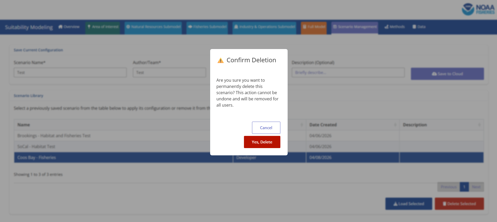

*Note: In order to delete a scenario you have to be the creator of the scenario or have admin privileges for the SMORES application. The creator of the scenario must log into SMORES from the same Posit Connect Account that was used to create the scenario. If you need a scenario removed but the author is no longer available to remove it please create an issue of Github that details the scenario to be removed and the reasoning. Admin of the SMORES app will then move forward with updating the scenarios. 

## Step 1: Navigate to the Scenario Management Tab

## Step 2: Select the Scenario to Delete

Please move your attention to the card titled 'Scenario Library'. You will see a table that contains previously created scenarios. Select the scenario that you have authored and would like to be removed. *Note a selected scenario will highlight to be dark blue. 

## Step 3: Delete the Scenario

Once you have selected a scenario that you have authored the 'Delete Selected' button in the bottom right corner will go from a muted red to a vibrant red color. The button changing color indicates that you have permission to delete that scenario. You will click the 'Delete Selected' button. A pop-up will generate confirming that you would like to permanently delete the scenario for all users. 

## Step 4: Confirm Deletion

You will select the 'Yes, Delete' button. After that button is selected you will be shown the scenario management tab once again. As you view the tab you will see that the deleted scenario is no longer available as an option to select. 

