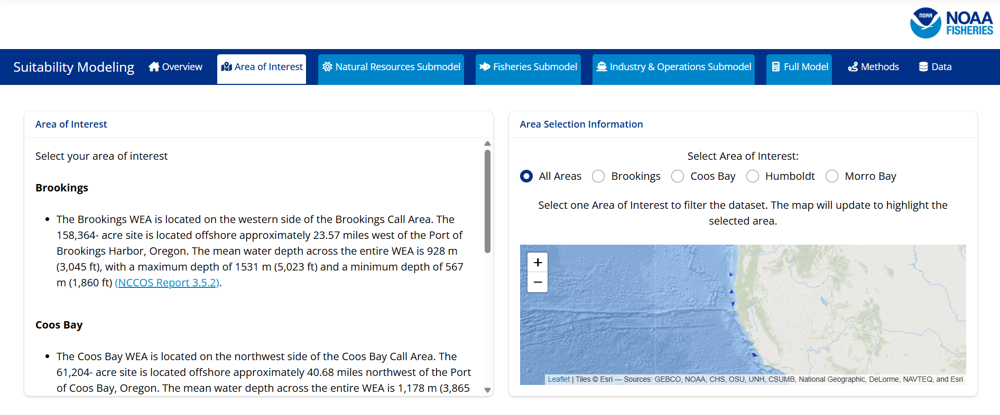
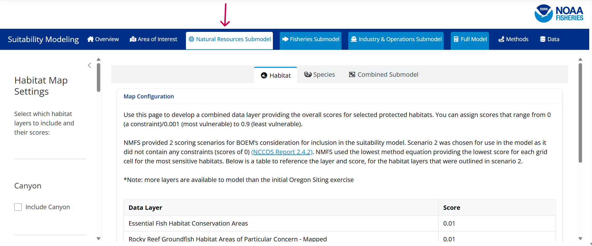
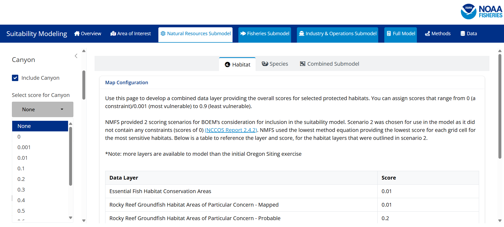
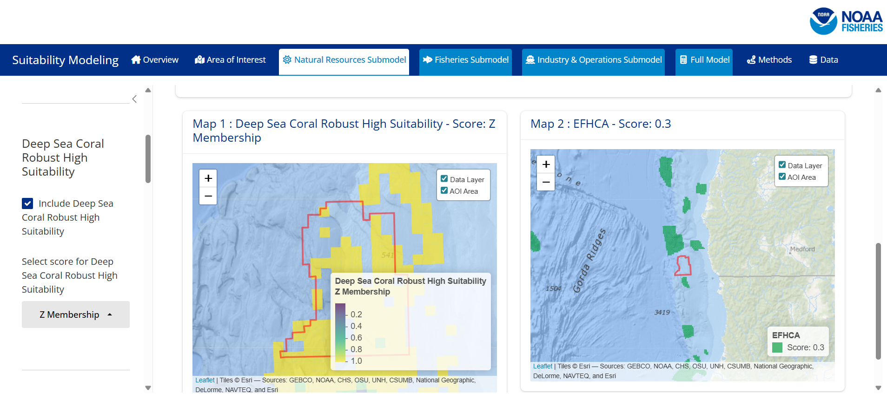
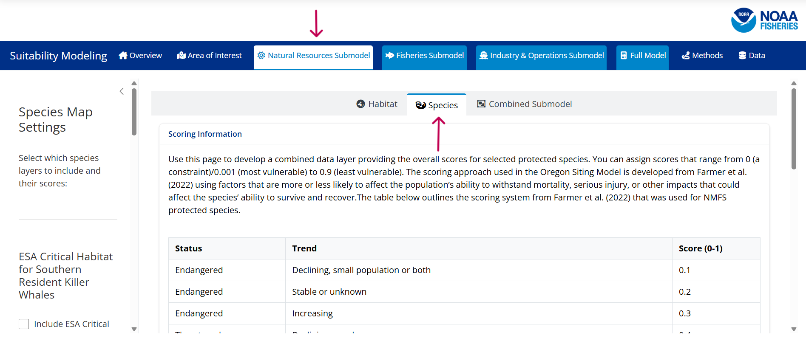
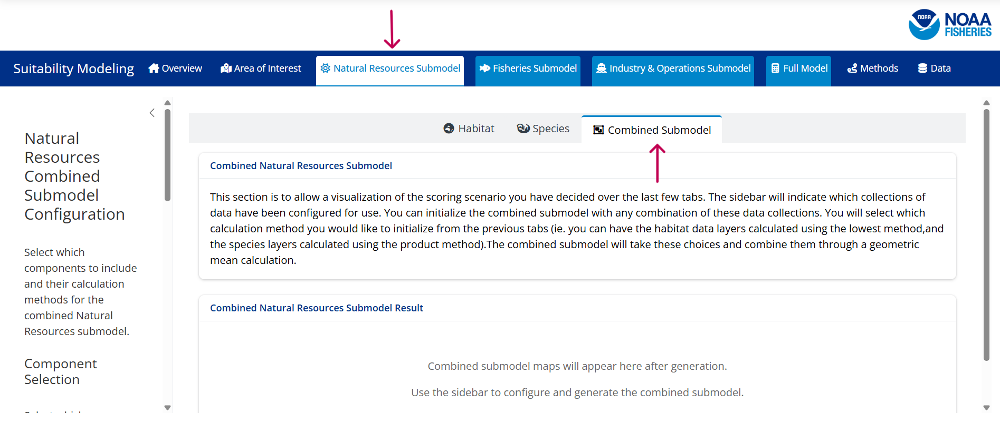

The dashboard is organized by the navigation bar at the top. There are 6 tabs: Area of Interest, Natural Resources Submodel, Fisheries Submodel, Industry & Operations Submodel, Full Model, Methods, and Data.

To generate a full model run you will move through the first 5 tabs from left to right.

Each sub-tab contains further detail on scoring suggestions and cues to generate the layers of your choice.

Step 1: Navigate to the Area of Interest tab and select a region you would like your analyses to focus on.

To select a different area of interest you will click on the desired area's button. 

By selecting an area of interest the maps will be set to pre-zoom to this area. No data will be lost it will mainly act as a narrowing tool to help visualize particular areas. If you prefer a more West COast scale view please select `All Areas`. 

Step 2: Navigate to the Natural Resources Submodel Tab.

You will start at the Habitat sub-tab and select the scores you would like in this model run.

To select a score for a layer you will first check the box next to the layer to initialize it. Once you have initialized the layer you will select a score from the drop down menu.

Scores typically go from 0 (exclude, very unsuitable) to 1 (most suitable). Some layers due to their structure will have alternative options such as the z-membership scores or a very limited option pool. If you have questions about which scores are represented on this app please reference the documents found in the methods section. 

As you configure the individual layers, individual maps are generated so you can visualize the overlap with your area of interest.

Each of these individual maps is selectable. The maps can be zoomed in or zoomed out and will show the full spread of the data if you continue to zoom out (the map on the right hand of the image is demonstrating a zoomed out view). Additionally, you can move the area of focus by dragging the map. 

*Note: if you initialized the layer but selected `None` for the score the map will not generate

Once you have configured your individual layer scores you will select the calculation method you would like used to combine these layers (geometric mean, lowest value, product). You will then select the `Generate Combined Map(s)` This will generate your combined maps. You can opt to export a copy of your results by selecting the `Export` button at the bottom of the page.

Step 3: Navigate to the Species tab and repeat the process you used for the habitat tab.

Step 4: Navigate to the Combined Submodel Tab. 

You will select which calculation method you would like for your combined maps to be included in the overall submodel calculation. You will then click on the generate Combined Submodel button which will produce 3 maps. The first map will represent the combined submodel score for the whole west coast. The second map will show the combined submodel score for the area of interest you previously selected. The third map will show the combined submodel for the area of interest normalized using a minimum maximum normalization.You can opt to export a copy of your results by selecting the Export button at the bottom of the page.

At this stage the Natural Resources Submodel that will be included in the Full Model has been generated.

Step 5: Repeat steps 2-4 for the Fisheries Submodel which will include selecting scores for fisheries and trawl fisheries layers. *Note that when you combine the fisheries layers with the trawl fishery layers the trawl fishery score will replace the score in grid cells within the top 75% of the trawl fisheries' ranked importance values. This is a different methodology than previous sections.

At this stage the Fisheries Submodel that will be included in the Full Model has been generated.

Step 6: Repeat steps 2-4 for the Industry & Operations Submodel which will include selecting scores for scientific surveys and submarine cable layers.

At this stage the Industry & Operations Submodel that will be included in the Full Model has been generated.

Step 7: Navigate to the Full Model Tab. You will select which submodels you would like to be included in the calculation of the full model and then select the weight you would like applied to each submodel. Once you have configured your submodels you will click on the generate Full Model button which will produce 3 maps.The first map will represent the full model scores for the whole west coast. The second map will show the full model scores for the area of interest you previously selected. The third map will show the full model for the area of interest normalized using a minimum maximum normalization.You can opt to export a copy of your results by selecting the Export button at the bottom of the page.