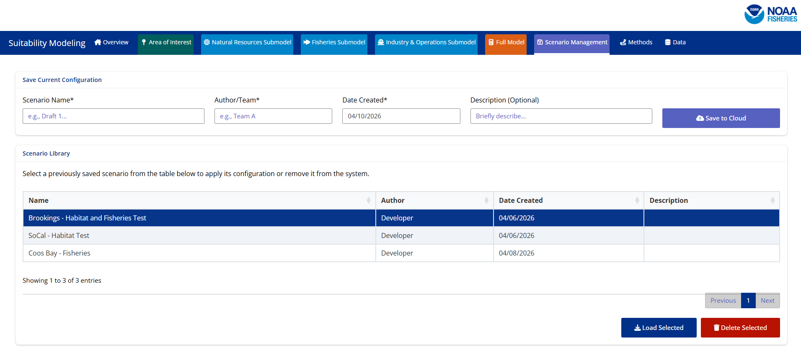
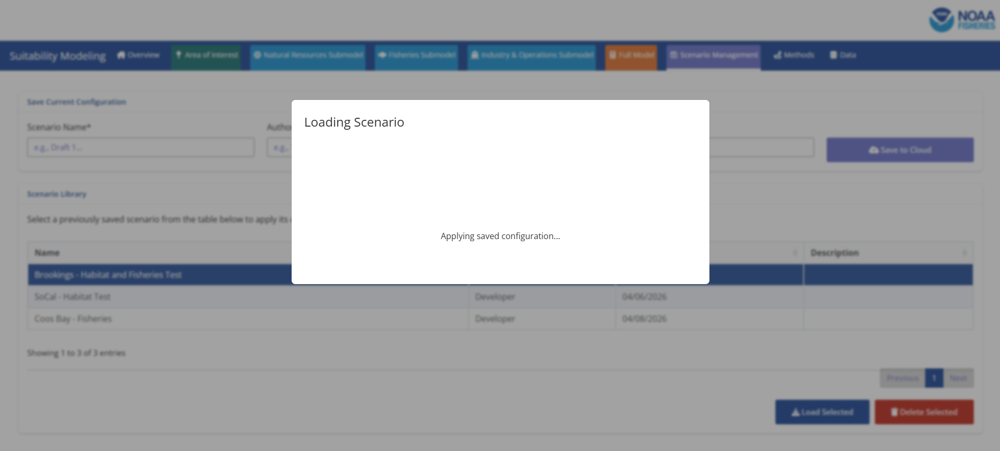

## Step 1: Navigate to the Scenario Management Tab

When you open the SMORES application please click on the Scenario Management tab. 

## Step 2: Select the Scenario of Interest

Please move your attention to the card titled 'Scenario Library'. You will see a table that contains pre-loaded scenarios. To select one of the scenarios click on the scenario of interest. *Note when you click on the scenario of interest it should highlight to a dark blue

## Step 3: Load Scenario of Interest

Once you have selected your scenario of interest you will select the 'Load Selected' button at the bottom right-hand side of the page. 

## Step 4: Navigate to the Area of Interest Tab

Once your scenario has completed loading the pop-up will be removed from the screen and you will once again see the scenario management tab. From here you will be free to move through the application and see what options were configured for this scenario. A good place to start is the area of interest tab so you can familiarize yourself with the area that was chosen. After the area of interest tab you can move through the rest of the application or pieces of the application that were configured. 

## Step 5: Generate Maps and Model Outputs

It is important to note that loading a scenario means that the application will be configured for loading maps and data. You will still need to select the 'Generate Maps' buttons to finalize the outputs you want to run through the combined modeling. The scenario contains the information of all maps initialized, scores selected, combination methods, and weights selected. 