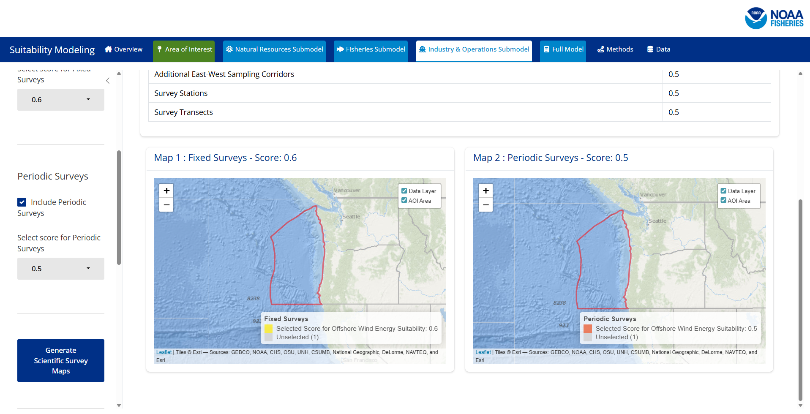
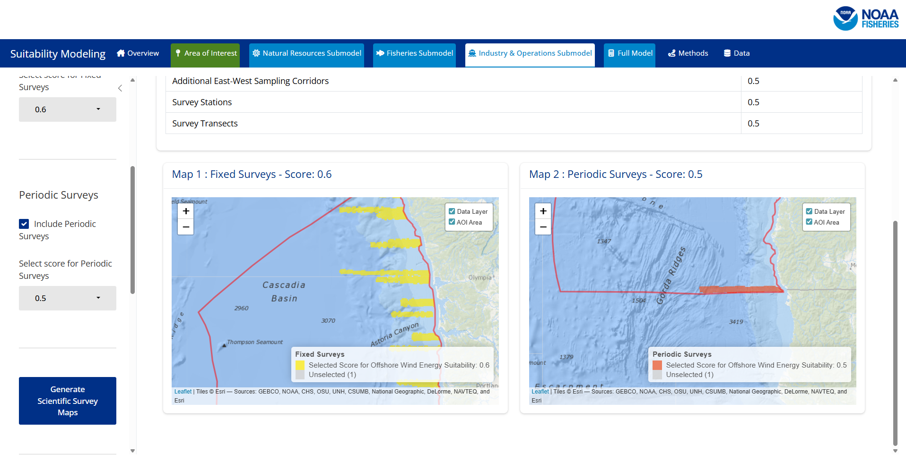

Here are some reminders and asked questions we have received about using the SMORES app. 

## Q: I opened SMORES on the Posit Connect Server and the screen is just white, what do I do?

A: SMORES takes a few minutes to load in the browser before the app main interface will appear. Loading of the application is usually between 1-3 minutes. If loading takes more than 10 minutes please leave a Github issue. 

## Q: What happens if I select `All Area` as the area of interest for the map to show data for?

A: The app will crash the current server environment due to memory usage constraints. If you are looking for a smaller scale map (i.e. a section of the West Coast), we recommend utilizing the included OCS planning areas to accomplish this. 

## Q: Why is SMORES accessed through the Posit Connect Test Server Instance?

A: SMORES is built to be used by NOAA personnel in order to effectively run modeling scenarios built off of the NCCOS Wind Energy Siting process. This application is not currently intended for use by the general public or other organizations. The Test Instance allows NOAA users access to the application hosted on a server while ensuring that the application is being used for its intended use of information gathering, by NOAA personnel and affiliates. 

## Q: I have selected a larger planning area (ie. Washington/Oregon) and the maps generate without data and just the Area of Interest boundary is visible. Why is the data not showing up?

A: The SMORES app does its best to show data at multiple scales using the mapping library leaflet(). Some of the large spatial areas essentially max out leaflet's capacity to show the data at the smaller scale maps (i.e. larger areas) due to the detailed information contained. In order to see the data that was loaded for the larger planning areas utilize the zoom (`+` button in the upper left hand corner of the map) to zoom in. You can select the zoom button as many times as needed for the data to appear on the interactive maps.

:::{layout-ncol=2}

:::

## Q: Can I use the SMORES app on my local machine instead of running through the Posit Connect Test Instance?

A: The SMORES application [Github repository](https://github.com/noaa-nwfsc/SMORES){target="_blank"} contains all of the components necessary to run SMORES locally. You can clone the repository and run the app locally using your NOAA affiliated Github log-in. *The app does require a substantial amount of RAM and memory to run so if you would like to run locally please consider the machine you are using. 

