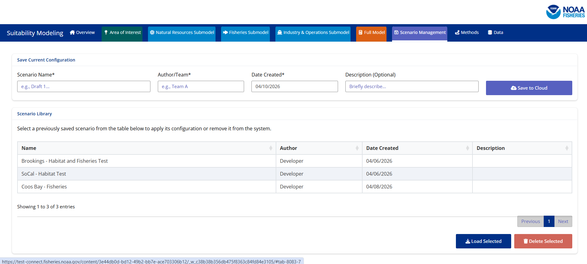
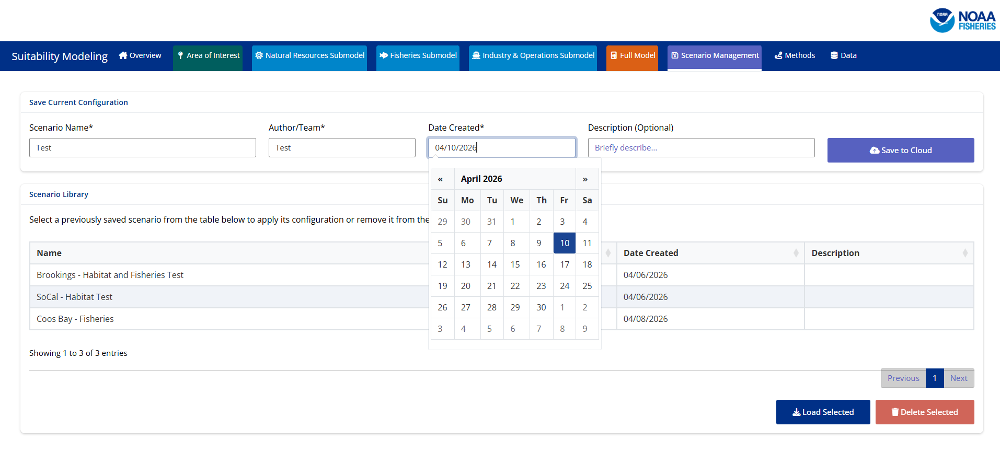

## Step 1: Create a Model Run

To save a scenario the first task is to create your model run. The model run must include an area of interest selected. From there you can configure the model to the extent you are looking for. This could be a model run that includes all 3 submodels, and all 6 components and the final model, or any combination of these pieces (ie. configured the habitat component and nothing else). 

## Step 2: Navigate to the Scenario Management Tab

Once you are at a point you want to save the scenario you have created please navigate to the scenario management tab. 

## Step 3: Save Your Scenario

On the scenario management tab you will use the top menu to save your current configuration. You will be required to proved a name for your scenario, the author/team that created it, and the date it was created. For the date you can either type the date in or use the calendar feature to select a date. It is also helpful to describe a brief description of what was configured in your scenario, the area of interest, or any other infromation you would like stored for other users to be able to view before loading. 

## Step 4: Save to the Cloud

Once you have entered the information to save your scenario you will select the 'Save to Cloud' button. Selecting this button creates a file in Posit Connect that stores the information for you scenario. After you hit the button the page should refresh and you should see the table at the bottom of the page update with your new scenario as a selectable option. 

## Things to Consider

- All scenarios saved are viewable and able to be loaded by any app user

- Scenarios are only able to be deleted by the author of the scenario or the app administrators
