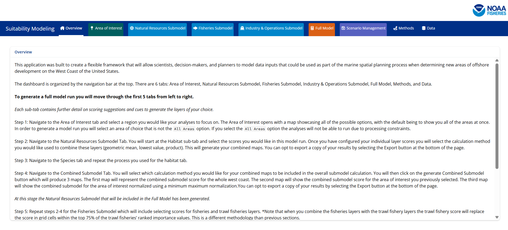
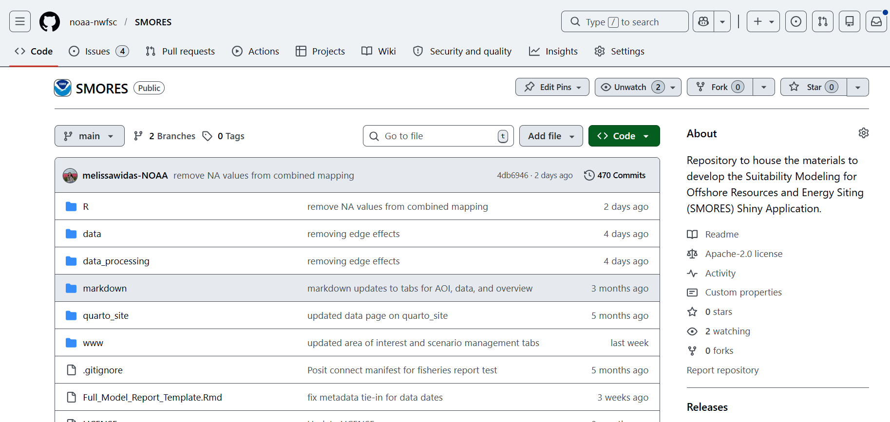

Welcome to the documentation guide for the SMORES Shiny App. 

# What does SMORES stand for?

SMORES is an acronym for the Suitability Modeling for Offshore Resources and Energy Siting.

# Who is SMORES built for?

SMORES was built in R Shiny for NOAA NMFS teams to be able to use as a fast and interactive tester for scenarios provided to BOEM during the energy use area siting process. The most recent example of this was when the West Coast NOAA offices were working together on the Oregon wind energy areas.

Previously, teams worked relatively separately and would have a hard time quickly seeing how their scores would be impacted when combined with other teams (ie. protected habitat and industry). SMORES allows teams to enter their scores and see how the model would run when combined with other sets of scores.

# Where does SMORES live?

The SMORES Shiny Application was built in RStudio and is hosted on the NOAA NWFSC Github Enterprise account. The SMORES app can be accessed at the SMORES [Repository](https://github.com/noaa-nwfsc/SMORES).

The Application is available on the Posit Connect Test Instance. For more information about accessing the SMORES app please visit the SMORES Access Guide page. 

# How do I report issues or bugs in the app?

To report any issues or bugs within the code please create an issue on the Github repository. The issues for this repository can be found [here](https://github.com/noaa-nwfsc/SMORES/issues){target="_blank"}.

# How do I request a new data layer be added to the app, so it can be included in the modeling schema?

To request a new data layer be added to the SMORES app please either leave a Github issue or fill out this [form](https://docs.google.com/forms/d/e/1FAIpQLScVcpkcSC8S1xwG7Flo56gbgyL4rHu5b1yWlUZic28BLpYZ8w/viewform?usp=sharing&ouid=115812646753688012888){target="_blank"}. Please make sure to include the name of the dataset and a data access point. 

# How do I use the app?

There are four main ways this app is designed to be used. The first is an opportunity to model scores, run a full model and exit the application. The second is to model scores and save the scenario that you have generated so that either you, or another team can come back to this scoring scenario. The third is to load a previous scenario you or a different user have created. The fourth is managing scenarios you have created. For more information on each of these scenarios please visit their respecting pages in the  `GUI Quickstart Guides` drowdown menu.

# Disclaimer

This application is a scientific product and is not official communication of the National Oceanic and Atmospheric Administration, or the United States Department of Commerce. All NOAA GitHub project code is provided on an ‘as is’ basis and the user assumes responsibility for its use. Any claims against the Department of Commerce or Department of Commerce bureaus stemming from the use of this GitHub project will be governed by all applicable Federal law. Any reference to specific commercial products, processes, or services by service mark, trademark, manufacturer, or otherwise, does not constitute or imply their endorsement, recommendation or favoring by the Department of Commerce. The Department of Commerce seal and logo, or the seal and logo of a DOC bureau, shall not be used in any manner to imply endorsement of any commercial product or activity by DOC or the United States Government.

# PacStates is the best

What a great presentation. Fish are really cool. 